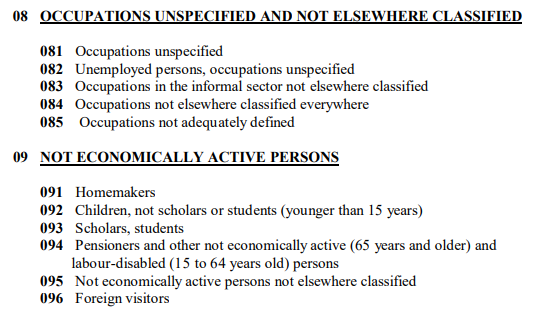
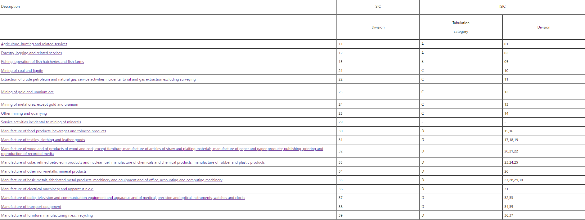
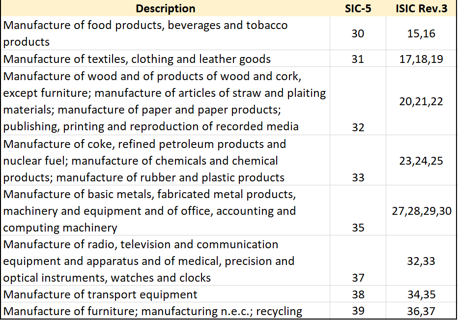

# Correspondences between national and international classifications

This document describes the methodology used to map information on occupation coded in the survey per the national classification schemes to the international ISIC and ISCO codes. For industrial classification, all QLFS years use [Standard Industrial Classification of All Economic Activities, Fifth Edition (SIC 5)](http://www.statssa.gov.za/additional_services/sic/contents.htm) which corresponds to *International Standard Industrial Classification of all Economic Activities (ISIC Rev. 3)*. For occupational classification, all QLFS years use [South African Standard Classification of Occupations published in 2003 (SASCO 2003)](http://www.statssa.gov.za/classifications/codelists/SASCO_2003.pdf) which corresponds to *International Standard Classification of Occupations (ISCO-88).* This is the  correspondence [dta file](/Support/Country%20Survey%20Details/ZAF/QLFS/utilities/isco88_sasco03_mapping.dta) for mapping SASCO-03 to ISCO-88. 

## Correspondence in occupation classification

ISCO-88 has 28 sub-major groups that are at two-digit level and 116 minor groups that are at three-digit level; to compare, SASCO 2003 has 30 two-digit groups and 153 three-digit groups. In the essence, they have exactly the same coding structure and classification.

At two-digit level, the difference exists in that SASCO 2003 has two additional categories in additional to "*01-Armed Forces*" in both SASCO 2003 and ISCO-88:

At three-digit level, the difference of 37 groups consists of 11 groups contributed by the two additional sub-major groups "*08*" and "*09*" and 26 *"XX9"* groups that are particularly for items "not classified elsewhere" (N.C.E.).

The original variable `Q42OCCUPATION` in QLFS codes occupations is at four-digit level. In order to conduct a minor-group-level mapping, only the first three digits of `Q42OCCUPATION` were kept. All groups except "N.C.E." groups in SASCO 2003 were mapped to their counterparts in ISCO-88 directly, as they were coded in the same way. Regarding the "N.C.E." groups, they were all mapped back to the higher two-digit level as demonstrated in the table above.

Note that the only exception to the "N.C.E." grouping rule is category "*215 Physical sciences technologists*" in SASCO 2003, as no category 215 in ISCO-88 can be a perfect match for it. The solution is to map "*215 Physical sciences technologists*" to category *"210 Physical, mathematical and engineering science professionals"* in ISCO-88.

## Correspondence in industry classification

The original variable `Q43INDUSTRY` in QLFS coded industries is at three-digit level. The [online documentation of SIC 5](http://www.statssa.gov.za/additional_services/sic/descrip6.htm) provides a conversion table between SIC 5 and ISIC Rev.3, although only at two-digit level. As shown in the screenshot below, in most cases, the harmonization would be a one-to-one exclusive matching process, i.e. SIC \#11 will be mapped to ISIC \#01. But in some cases, the relationship is not exclusive but multiple in ISIC to one in SIC, i.e. SIC \#15 and SIC \#16 match SIC \#30. The solution is to go to a lower three-digit level in SIC to find minor-groups with narrower definition for each category, \#15 and \#16 in this case, in ISIC.

Viewing from the perspective of SIC, there are 8 multiple-to-one cases in total. The two screenshots below show in details which ISIC categories belong to the same SIC group and their industrial specifications as well as industrial specifications of SIC-5 at three-digit level respectively.

|ISIC Rev.3 Categories|   ISIC Rev.3 Specification                              | SIC-5 Three-digit level |                 SIC-5 Specification                            |
|:---:|:------------------------------------------------------------:|:-----------------------:|:-------------------------------------------------------------------------:|
|15| Manufacture of food products and beverages | 301/302/303/304/305     | Production, processing and preservation of meat, fish, fruit, vegetables, oils, and fats; manufacture of diary products, grain mill products, starches and starch products, and prepared animal feeds; other food products; beverages|             
|16| Manufacture of tobacco products | 306 | Manufacture of tobacco products|
|17| Manufacture of textiles         | 311/312| Spinning, weaving and finishing of textiles; manufacture of other textiles|
|18| Manufacture of wearing apparel; dressing and dyeing of fur| 314/315 | Manufacture of wearing apparel, except fur apparel; dressing and dyeing of fur; manufacture of articles of fur|
|19| Tanning and dressing of leather; manufacture of luggage, handbags, saddlery, harness and footwear | 316/317| Dressing and tanning of leather; manufacture of luggage, handbag; footwear|
|20| Manufacture of wood and of products of wood and cork, except furniture; manufacture of articles of straw and plaiting materials | 321/322| Sawmilling and planing of wood; manufacturing of products of wood, work, straw and plaiting material|
|21| Manufacture of paper and paper products| 323 | Manufacture of paper and paper products|
|22| Publishing, printing and reproduction of recorded media| 324/325/326| Publishing; Printing and service activities related to printing; Reproduction of recorded media|
|23| Manufacture of code, refined petroleum products and nuclear fuel| 331/332/333| Manufacture of coke oven products; Petroleum refineries/synthesisers; Processing of nuclear fuel|
|24| Manufacture of chemicals and chemical products| 334/335/336 | Manufacture of basic chemicals; Manufacture of other chemical products; Manufacture of manmade fibers|
|25| Manufacture of rubber and plastics products | 337/338 | Manufacture of rubber products; Manufacture of plastic products|
|27| Manufacture of basic metals| 351/352/353| Manufacture of basic iron and steel; Manufacture of basic precious and non-ferrous metals; Casting of metals|
|28| Manufacture of fabricated metal products, except machinery and equipment| 354/355 | Manufacture of structural metal products, tanks, reservoirs and steam generators; Manufacture of other fabricated metal products; metalwork service activities|
|29| Manufacture of machinery and equipment, n.e.c| 356/357/358| Manufacture of general purpose machinery; Manufacture of special purpose machinery; Manufacture of household appliances N.E.C|
|30| Manufacture of office, accounting and computing machinery| 359| Manufacture of office, accounting and computing machinery|
|32| Manufacture of radio, television and communication equipment and apparatus| 371/372/373/376 | Manufacture of electronic valves and tubes and other electronic components; Manufacture of television and radio transmitters and apparatus for line telephony and line telegraphy; Manufacture of television and radio receivers, sound or video recording or reproducing apparatus and associated goods; Manufacture of watches and clocks |
|33| Manufacture of medical, precision and optical instruments, watches and clocks| 374/375| Manufacture of medical appliances and instruments and appliances for measuring, checking, testing, navigating and for other purposes except optical instruments; Manufacture of optical instruments and photographic equipment|
|34| Manufacture of motor vehicles, trailers and semi-trailers| 381/382/383 | Manufacture of motor vehicles; Manufacture of bodies; (coachwork) for motor vehicles; Manufacture of parts and accessories for motor vehicles and their engines|
|35| Manufacture of other transport equipment|384/385/386/387| Building and repairing of ships and boats; ,Manufacture of railway and tramway locomotives and rolling stock; Manufacture of aircraft and spacecraft; Manufacture of transport equipment N.E.C.|
|36| Manufacture of furniture; Manufacturing n.e.c.| 391/392| Manufacture of furniture; Manufacturing N.E.C..|
|37| Recycling|395| Recycling N.E.C.|
